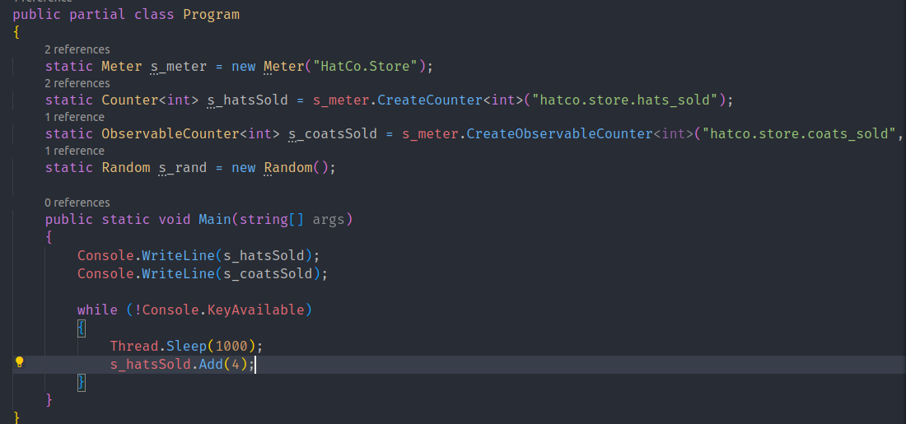
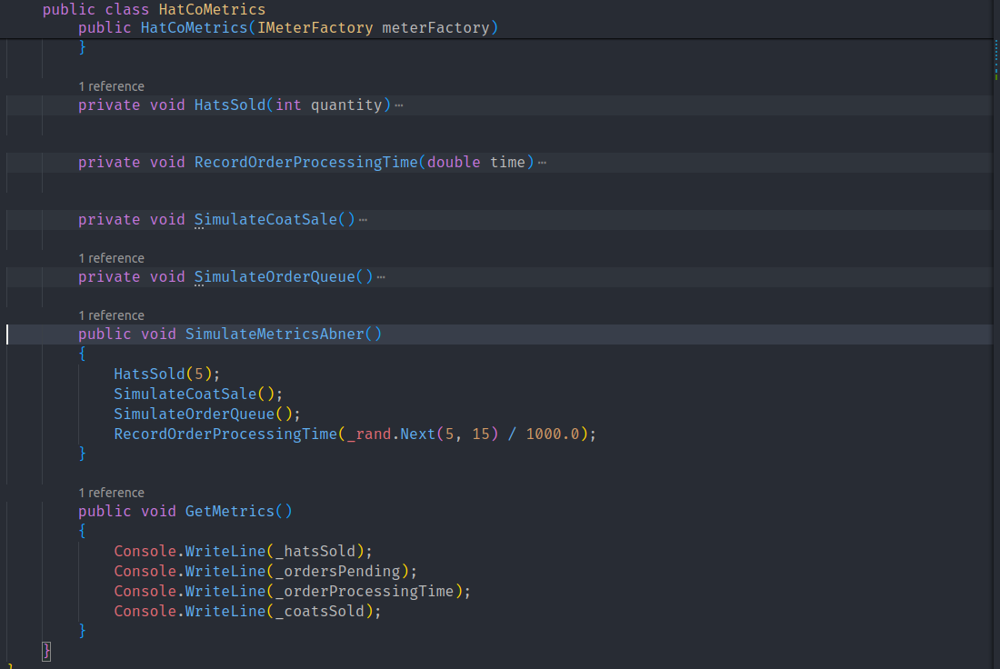
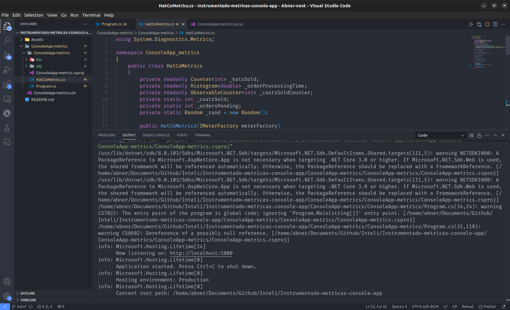
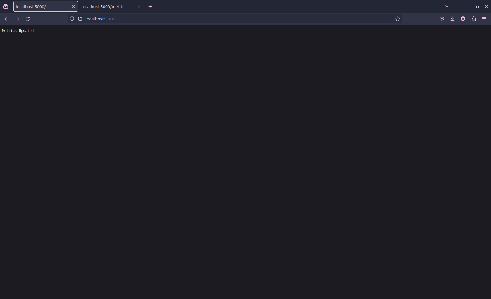
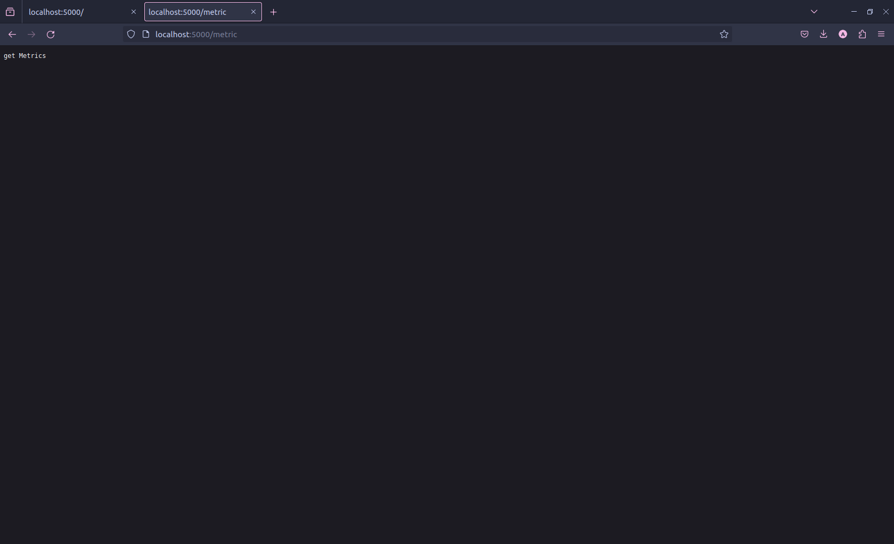
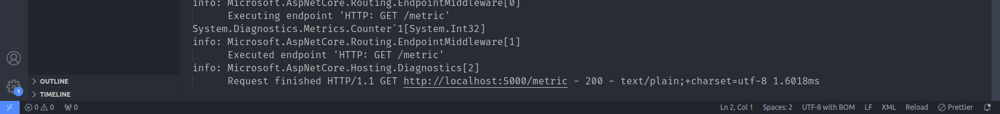

# Relatório de Avanço: Métricas em .NET
## Artigo: Métricas Personalizadas em .NET


### Introdução

Neste relatório, registrei nosso progresso na implementação de métricas personalizadas em aplicativos .NET, seguindo as orientações do artigo "Métricas Personalizadas em .NET".

### Utilização
- SDK Utilizado: .NET Core 6 e versões posteriores
- Pacote NuGet: System.Diagnostics.DiagnosticSource versão 8 ou superior
- Versões do .NET Suportadas: .NET Core 6 e .NET Framework 4.6.1 e posteriores

### Conceitos Aprendidos
- Criação de Métricas Personalizadas:
  - Utilizei a classe Meter para criar um grupo nomeado de instrumentos.
  - Criei instrumentos do tipo Counter para registrar contagens.
  - Aprendi a utilizar a API CreateCounter para criar instrumentos do tipo Counter.

<br>

- Tipos de Instrumentos Disponíveis:
  - Diferentes tipos de instrumentos, incluindo Counter, UpDownCounter, ObservableCounter, Histogram, e ObservableGauge.
  - Diferenças entre eles e suas aplicações práticas.

<br>

- Práticas Recomendadas:
  - Aprendi boas práticas, como a criação de medidores apenas uma vez para códigos não destinados à DI e seguir diretrizes de nomenclatura para instrumentos e marcas.
  - A importância de sincronização em acessos concorrentes e o impacto no desempenho.


### Execução do Programa

Para inicializar a aplicação eu apenas executei o arquivo <code>ConsoleApp-metrics.csproj</code> com a extensão [Code runner](https://marketplace.visualstudio.com/items?itemName=formulahendry.code-runner)

**Alem de ter o dotnet na maquina na versão 8^**

### Códigos implementados para registrar e modificar as metricas (Prints e codigo)

O codigo abaixo representa o Program.cs, com a inicialização de uma API além de ter começado a registrar as metricas



```csharp

// Rota para dar update nas metricas em outra class.
app.MapGet("/", (HatCoMetrics hatCoMetrics) =>
{
    hatCoMetrics.SimulateMetricsAbner();
    return "Metrics Updated";
});

// Rota para printar no console.log as metricas registradas.
app.MapGet("/metric", (HatCoMetrics hatCoMetrics) =>
{
    hatCoMetrics.GetMetrics();
    return "get Metrics";
});

app.Run();

public partial class Program
{
    static Meter s_meter = new Meter("HatCo.Store");
    static Counter<int> s_hatsSold = s_meter.CreateCounter<int>("hatco.store.hats_sold");
    static ObservableCounter<int> s_coatsSold = s_meter.CreateObservableCounter<int>("hatco.store.coats_sold", () => s_rand.Next(1, 10));
    static Random s_rand = new Random();

    public static void Main(string[] args)
    {
        Console.WriteLine(s_hatsSold);
        Console.WriteLine(s_coatsSold);

        while (!Console.KeyAvailable)
        {
            Thread.Sleep(1000);
            s_hatsSold.Add(4);
        }
    }
}

```
<br>

O codigo abaixo representa o HatCoMetrics.cs, onde tem as funções para simular os valores das metricas criadas, sendo possivel ver a função de simular as metricas (SimulateMetricsAbner) e a função para printar as metricas (GetMetrics).



```csharp
        private void HatsSold(int quantity)
        {
            _hatsSold.Add(quantity);
        }

        private void RecordOrderProcessingTime(double time)
        {
            _orderProcessingTime.Record(time);
        }

        private void SimulateCoatSale()
        {
            _coatsSold += 5;
        }

        private void SimulateOrderQueue()
        {
            _ordersPending = _rand.Next(0, 25);
        }

        public void SimulateMetricsAbner()
        {
            HatsSold(5);
            SimulateCoatSale();
            SimulateOrderQueue();
            RecordOrderProcessingTime(_rand.Next(5, 15) / 1000.0);
        }

        public void GetMetrics()
        {
            Console.WriteLine(_hatsSold);
            Console.WriteLine(_ordersPending);
            Console.WriteLine(_orderProcessingTime);
            Console.WriteLine(_coatsSold);
        }
```


Abaixo estão os prints da execução do programa exibindo as saídas do console/terminal:






## Conclusão

Este relatório documenta o progresso na implementação de métricas personalizadas em aplicativos .NET, conforme descrito. aprendi a criar e registrar diferentes tipos de instrumentos, bem como "linkar" métricas para uma análise mais detalhada. Além disso, entendemos a importância das práticas recomendadas para garantir um código de fácil manutenção.# Ponderada-semana-4-ES10
